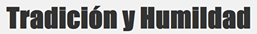

# Proyecto 1
Para el siguiente proyecto se necesitará contar con android studio 3.0 o versiones más recientes.

## Proposito
El desarrollo de la app tiene la finalidad de mostrar la informacion de algun pequeño negocio, ciertos datos del mismo y 
un par de imagenes similes.

Como agregado nosotros incluimos la implementacion de un hipervinculo hacia el sitio web del negocio a mostrar.

## Archivo de diseño XML
~~~
<?xml version="1.0" encoding="utf-8"?>
<android.support.constraint.ConstraintLayout xmlns:android="http://schemas.android.com/apk/res/android"
    xmlns:app="http://schemas.android.com/apk/res-auto"
    xmlns:tools="http://schemas.android.com/tools"
    android:layout_width="match_parent"
    android:layout_height="match_parent"
    tools:context=".MainActivity">
    //declaracion del layout con alineacion vertical
    <LinearLayout
        android:layout_width="wrap_content"
        android:layout_height="wrap_content"
        android:orientation="vertical">
        //declaracion de la imagen de cabecera
        <ImageView
            android:layout_width="wrap_content"
            android:layout_height="159dp"
            android:layout_marginLeft="0dp"
            android:minHeight="100dp"
            android:minWidth="300dp"
            //la siguiente declaracion identifica que imagen va de cabecera dentro de la vista haciendo referencia a los recursos drawable
            app:srcCompat="@drawable/top" />
        //declaracion de la vista de texto con el nombre de la empresa
        <TextView
            android:layout_width="wrap_content"
            android:layout_height="wrap_content"
            android:text="Tamales Don Chon"
            android:textSize="30dp"
            android:layout_marginTop="10dp"/>
        //declaracion de la vista de texto con el telefono de la empresa
        <TextView
            android:layout_width="wrap_content"
            android:layout_height="wrap_content"
            android:text="Tel: 477- 575- 2551"
            android:textSize="20dp"
            android:layout_marginLeft="90dp"
            android:layout_marginTop="10dp"/>
      //declaracion de la vista de texto con la direccion de la empresa
        <TextView
            android:layout_width="wrap_content"
            android:layout_height="wrap_content"
            android:text="Calle Adela #123\nPeñitas 37180,León,Gto.,\nMéxico. "
            android:textSize="20dp"
            android:layout_marginLeft="90dp"
            android:layout_marginTop="20dp"/>
      //declaracion de la vista de texto con los horarios de la empresa
        <TextView
            android:layout_width="wrap_content"
            android:layout_height="wrap_content"
            android:text="Lunes – Viernes 7:00PM – 10:00PM\nSábados 6:00PM – 10:00PM\nDomingos 8:00PM – 11:00PM"
            android:textSize="20dp"
            android:layout_marginLeft="0dp"
            android:layout_marginTop="20dp"/>
      //declaracion del hipervinculo
        <TextView
            android:id="@+id/enlace"
            android:layout_width="wrap_content"
            android:layout_height="wrap_content"
            //en esta declaracion se hace referencia a un recurso dentro del archivo strings que más adelante se mostrará
            android:text="@string/web"
            android:textSize="20dp"
            android:layout_marginLeft="10dp"
            android:layout_marginTop="10dp"
            //las siguientes 2 declaraciones son necesarias para que el hipervinculo sea mostrado y pueda ser clickeado
            android:autoLink="web"
            android:linksClickable="true"
            />
        //declaracion de la ultima vista que es la imagen de pie
        <ImageView
            android:layout_width="wrap_content"
            android:layout_height="wrap_content"
            android:minWidth="300dp"
            android:minHeight="100dp"
            android:layout_marginLeft="50dp"
            android:layout_marginTop="0dp"
            app:srcCompat="@drawable/bot" />

    </LinearLayout>

</android.support.constraint.ConstraintLayout>
~~~
***
## Archivo Strings.XML de los recursos
~~~
<resources>
    <string name="app_name">Tamalitos</string>
    <string name="web">https://ustil.000webhostapp.com/Proyecto/index.php</string>
</resources>
~~~
***
## Imagen de cabecera

## Imagen de pie

Dichas imagenes deben ser puestas dentro de la carpeta del siguiente directorio:
C:\*ubicacion del proyecto*\app\src\main\res\drawable
